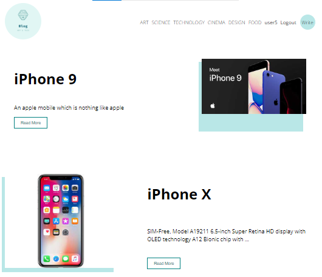
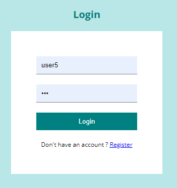
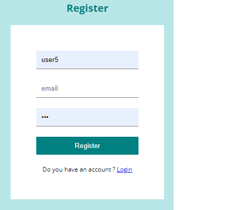

# React Blog App

Blog application using React. 

You can see the website [here](https://blog-app-firebase.netlify.app/)

You can find the Node.js/PostgreSQL REST API backend [here](https://github.com/adarraji/blog-app-api-firebase)

On the home page all posts are fetched from PostgreSQL database. 

Users can register, login and logout.

When you click on a post, you get a single post details, user information and a side bar that recommends similar posts. 

The owner of the post can edit or delete the post after login. 

Users can create/edit posts, upploaded images, select/change category and publish posts.  

The image files are being stored in Firebase

## Built With

* HTML
* CSS
* Javascript
* React
* styled-components
* React Router
* React Hooks
* React Context API 
* Firebase

## Running the Application

To run the application

1. Clone this repo
2. Run `npm install`
3. Run `npm start`
 

## Environmental Variables

### Server Base URL

Add the backend server base url `REACT_APP_BASE_URL` in:

* `src/pages/Register.js`
* `src/context/authContext.js`
* `src/pages/Home.js`
* `src/pages/Single.js`
* `src/pages/Write.js`
* `src/components/Menu.js`

Or create .env file for React app

`REACT_APP_BASE_URL=http://localhost:3000/api/` 

then use it like this

 `process.env.REACT_APP_BASE_URL`
 
 

### Firebse App Configuration File

Add Firebase configuration variables in `src/firebase.js`.
 
 

## Deployment

Deployed on [Netlify](https://netlify.com)
You can see the website [here](https://blog-app-firebase.netlify.app/)

## Authors  

- **Ali Darraji** - [https://github.com/adarraji](https://github.com/adarraji)

## Deploy status

## Screenshots
 

### Home Page

 

 

 

 

 

 

 
 
 